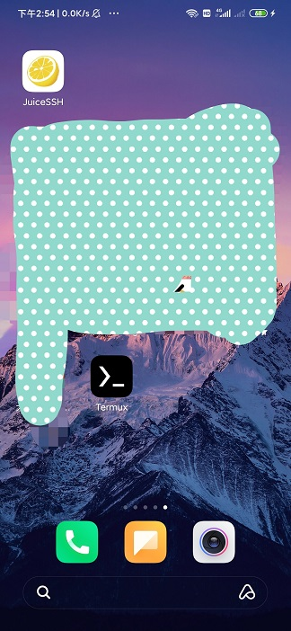
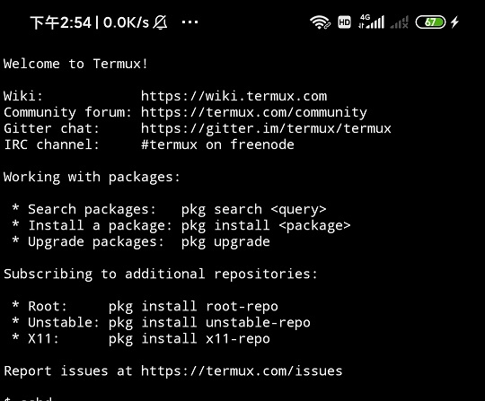

## Termux 安装教程

Termux是国外技术大牛开发的Linux Terminal的模拟器，它支持安装Python、GCC、Go等各种Linux软件，更为重要的是，在Termux中可以安装ubuntu、centos、kali等linux系统。

    个人猜测，Termux是运行到Android系统上的一套虚拟机。
    这个虚拟机并不是VMWare这种完全虚拟硬件的，而是类似Docker虚拟出来一个隔离的环境。
    故而在Termux的基础上，又可以安装各种linux系统，这种模式和Docker很像。

### 安卓手机安装Termux

Termux官网: termux.com

Termux 安装包下载: [Termux下载](./files/com.termux_92.apk)

下载后直接安装。

打开 Termux:

### Termux安装软件

首先安装必要软件：

    pkg install wget proot

然后重启。

后续你可以安装Python等编程环境。

    pkg install python
    pkg install clang
    pkg install golang